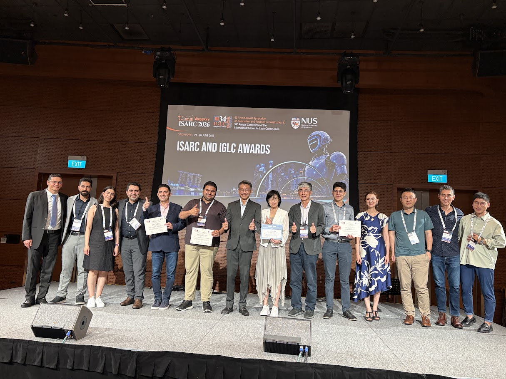

Our paper **"A Plug-and-Play Semantic Execution Framework for Reusable Cross-Domain Automation in Digital Twins"** received the **Best Paper Award** at the 43rd International Symposium on Automation and Robotics in Construction (ISARC 2026), held in Singapore.

The paper presents a plug-and-play semantic execution architecture that decouples domain knowledge from IT infrastructure, enabling reusable automation across different facility domains without reconfiguration.

